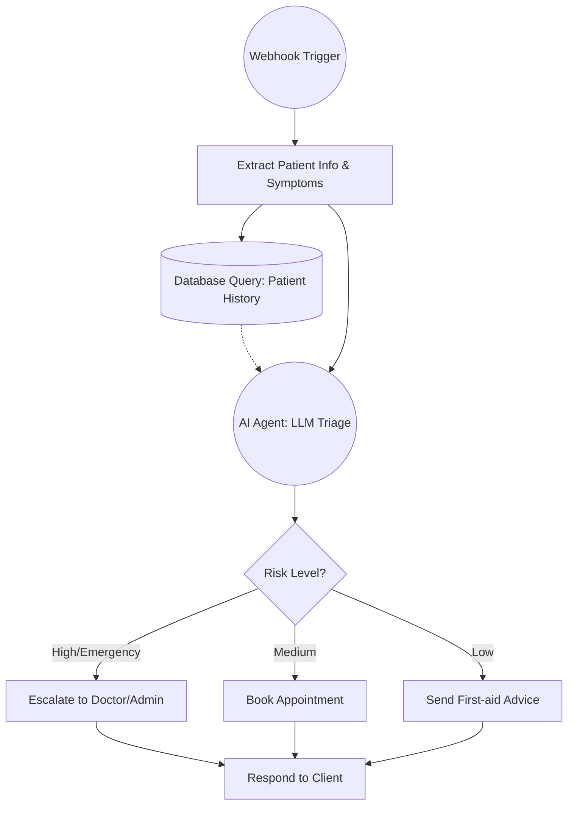

<h1 align="center">
  <br>
  🏥 Medinfo — Hospital Management & AI Triage System
  <br>
</h1>

<p align="center">
  <strong>A full-stack, production-ready platform combining an intelligent AI triage engine with a modern hospital management web application.</strong>
</p>

<p align="center">
  
  
  
  
  
  
  
</p>

---

## 📖 Table of Contents

- [Overview](#-overview)
- [Architecture](#-architecture)
- [Repository Structure](#-repository-structure)
- [Feature Breakdown](#-feature-breakdown)
  - [Hospital Management Web App](#1-hospitalmanagementwebpage)
  - [AI Medical Triage Chatbot](#2-medical-chatbot--ai-triage-engine)
  - [n8n Automation Workflow](#3-n8n-workflow-integration)
- [Tech Stack](#-tech-stack)
- [Getting Started](#-getting-started)
  - [Prerequisites](#prerequisites)
  - [Hospital Web App Setup](#hospital-web-app-setup)
  - [AI Triage Backend Setup](#ai-triage-backend-setup)
- [Environment Variables](#-environment-variables)
- [API Reference](#-api-reference)
- [n8n Workflow](#-n8n-automation-workflow)
- [Docker Deployment](#-docker-deployment)
- [Project Roadmap](#-project-roadmap)
- [Contributing](#-contributing)
- [License](#-license)

---

## 🌟 Overview

**Medinfo** is a comprehensive, dual-module healthcare platform designed to modernize hospital operations and patient intake through AI. It addresses two critical pain points in modern healthcare:

1. **Patient Overload at Triage**: An AI-powered symptom classifier (using RAG + local LLMs via Ollama) instantly routes patients to the correct department, reducing wait times and clinician workload.

2. **Fragmented Hospital Management**: A sleek, full-featured web application handles appointments, medical records, lab test bookings, billing, doctor directories, and department management — all secured behind Supabase authentication.

Together, these systems form a unified, enterprise-grade hospital platform suitable for deployment in real clinical environments.

---

## 🏗️ Architecture

```
┌─────────────────────────────────────────────────────────────────────┐
│                        MEDINFO PLATFORM                              │
│                                                                       │
│  ┌──────────────────────────┐    ┌──────────────────────────────┐    │
│  │  Hospital Management UI   │    │    AI Triage Engine           │    │
│  │  (React + Vite + Radix)  │    │  (FastAPI + RAG + ChromaDB)  │    │
│  │                           │    │                              │    │
│  │  • Dashboard              │    │  • Symptom Classification    │    │
│  │  • Appointments           │    │  • Department Routing        │    │
│  │  • Medical Records        │    │  • Severity Scoring          │    │
│  │  • Test Booking           │    │  • Clinical Recommendations  │    │
│  │  • Billing                │    │                              │    │
│  │  • AI Chatbot Widget      │◄───┤  POST /classify              │    │
│  │  • Doctor Directory       │    │  GET  /departments           │    │
│  │  • Departments            │    │                              │    │
│  │                           │    │   Streamlit Testing GUI      │    │
│  └─────────────┬─────────────┘    └──────────────┬───────────────┘    │
│                │                                  │                    │
│                ▼                                  ▼                    │
│         Supabase Auth                     Ollama (Local LLM)           │
│         (PostgreSQL)                  ChromaDB (Vector Store)          │
│                                      Sentence-Transformers             │
└─────────────────────────────────────────────────────────────────────┘
                              │
                              ▼
                    n8n Automation Workflow
               (Webhook → AI Triage → Route/Alert)
```

---

## 📁 Repository Structure

```
Medinfo-Hospital-Management-and-AI-Triage-System/
│
├── 📄 README.md                        ← You are here
├── 📄 .gitignore                       ← Unified ignore rules
├── 📄 n8n_workflow_diagram.md          ← Mermaid diagram for n8n pipeline
│
├── 📂 Hospitalmanagementwebpage/       ← React Frontend
│   ├── index.html
│   ├── vite.config.ts
│   ├── package.json
│   └── src/
│       ├── App.tsx                     ← Root app with auth & routing
│       ├── supabaseClient.ts           ← Supabase config
│       ├── index.css                   ← Global styles
│       └── components/
│           ├── Auth.tsx                ← Login / Register flow
│           ├── Dashboard.tsx           ← Main stats overview
│           ├── Appointments.tsx        ← Appointment scheduler
│           ├── TestBooking.tsx         ← Lab test booking
│           ├── MedicalRecords.tsx      ← Patient health records
│           ├── Chatbot.tsx             ← AI assistant widget
│           ├── Doctors.tsx             ← Doctor directory
│           ├── Departments.tsx         ← Department browser
│           ├── Billing.tsx             ← Payment & invoices
│           └── Profile.tsx             ← User profile management
│
└── 📂 medical-chatbot/                 ← Python AI Backend
    ├── streamlit_app.py                ← Streamlit testing GUI
    ├── requirements.txt                ← Python dependencies
    ├── startup.bat                     ← Windows one-click launch
    ├── startup.sh                      ← Linux/macOS launch
    ├── Dockerfile                      ← Backend Docker image
    ├── Dockerfile.streamlit            ← Streamlit Docker image
    ├── docker-compose.yml              ← Core services
    ├── docker-compose.full.yml         ← Full stack incl. Streamlit
    ├── .env.example                    ← Environment variable template
    ├── .streamlit/
    │   └── config.toml                 ← Streamlit theme config
    ├── app/
    │   ├── main.py                     ← FastAPI entry point
    │   ├── config.py                   ← App configuration
    │   ├── models/
    │   │   └── schemas.py              ← Pydantic data models
    │   ├── services/
    │   │   ├── rag_service.py          ← RAG orchestration logic
    │   │   ├── llm_service.py          ← Ollama LLM integration
    │   │   └── embedding_service.py    ← Sentence-Transformer embeddings
    │   ├── db/
    │   │   └── vector_db.py            ← ChromaDB vector store wrapper
    │   └── utils/
    │       └── prompts.py              ← Department/symptom mappings
    └── data/
        └── medical_docs/               ← Source medical knowledge base
```

---

## 🔥 Feature Breakdown

### 1. `Hospitalmanagementwebpage/`

A production-grade hospital management SPA built with **React 18 + Vite + TypeScript**, styled with **TailwindCSS** and **Radix UI** primitives.

| Module | Description |
|---|---|
| **Authentication** | Supabase-powered login/register with email, Google OAuth, and session persistence |
| **Dashboard** | Real-time KPI cards — active patients, pending appointments, revenue, bed availability |
| **Appointments** | Book, view, and manage patient appointments with date-time pickers |
| **Test Booking** | Schedule lab tests (blood work, X-ray, MRI, etc.) with status tracking |
| **Medical Records** | Structured EHR viewer — diagnoses, prescriptions, test results, history |
| **AI Chatbot** | Embedded widget connected to the triage backend for symptom guidance |
| **Doctor Directory** | Browse physicians by specialty, view availability and ratings |
| **Departments** | Explore hospital departments with bed counts and contact info |
| **Billing** | Invoice management, payment status, and downloadable receipts |
| **Profile** | User settings, avatar, personal & insurance information |
| **Emergency Access** | Floating quick-dial button for the 24/7 emergency hotline |

**Key Design Decisions:**
- All state management handled via React hooks (no Redux overhead for an SPA of this scale)
- Supabase Realtime is used for live session updates
- Radix UI provides fully accessible, unstyled primitives for custom design control
- Recharts for responsive data visualisations on the Dashboard

---

### 2. `medical-chatbot/` — AI Triage Engine

A **Retrieval-Augmented Generation (RAG)** pipeline that classifies patient symptoms, determines emergency severity, routes to the correct department, and provides an actionable clinical recommendation — all running locally via **Ollama**.

#### How it works

```
Patient Symptoms (list of strings)
         │
         ▼
 Sentence-Transformers Embedding
         │
         ▼
 ChromaDB Semantic Similarity Search
  (against medical knowledge base)
         │
         ▼
 Relevant Medical Docs Retrieved (Top-K)
         │
         ▼
 Ollama LLM (qwen2 / meditron)
  + System Prompt Engineering
         │
         ▼
 Structured JSON Response:
  • emergency_type  (Critical / Urgent / Emergent / Non-emergent)
  • department      (Cardiology, Neurology, etc.)
  • symptoms_matched
  • confidence
  • recommendation
```

#### Severity Levels

| Level | Colour | Description |
|---|---|---|
| 🚨 **Critical** | Red | Immediate life-threatening — e.g., MI, stroke |
| ⚠️ **Urgent** | Orange | Serious, requires prompt evaluation within 30 min |
| ⏰ **Emergent** | Yellow | Significant condition, needs evaluation within a few hours |
| ✅ **Non-emergent** | Green | Routine care, suitable for scheduled appointment |

#### Streamlit Testing GUI
A polished **Streamlit** interface (`streamlit_app.py`) is included for rapid testing of the triage engine with:
- Free-text symptom entry
- Preset templates (Heart Attack, Stroke, GI Issues, Dental)
- Real-time result cards with animated severity indicators
- Session history with averages and department routing stats
- Export to JSON / CSV

---

### 3. n8n Workflow Integration

A companion **n8n automation workflow** handles end-to-end patient request orchestration:



See [`n8n_workflow_diagram.md`](./n8n_workflow_diagram.md) for the full annotated diagram.

---

## 🛠️ Tech Stack

### Frontend (Hospital Web App)
| Technology | Purpose |
|---|---|
| React 18 + TypeScript | UI framework |
| Vite 6 | Build tooling & dev server |
| TailwindCSS | Utility-first styling |
| Radix UI | Accessible component primitives |
| Supabase JS | Auth & real-time database |
| Recharts | Data visualisation |
| Lucide React | Icon library |
| React Hook Form | Form state management |

### Backend (AI Triage Engine)
| Technology | Purpose |
|---|---|
| FastAPI 0.104 | High-performance REST API |
| Uvicorn | ASGI server |
| ChromaDB 1.5 | Vector similarity search |
| Sentence-Transformers | Symptom text embeddings |
| Ollama | Local LLM inference (qwen2 / meditron) |
| Streamlit 1.28+ | Testing & demo GUI |
| Pandas | Data export (CSV) |
| Python-dotenv | Env config management |
| Pydantic v2 | Data validation & serialisation |
| Docker | Containerisation |

---

## 🚀 Getting Started

### Prerequisites

| Tool | Version | Install |
|---|---|---|
| Node.js | ≥ 18 | [nodejs.org](https://nodejs.org) |
| Python | ≥ 3.10 | [python.org](https://python.org) |
| Ollama | Latest | [ollama.ai](https://ollama.ai) |
| Git | Any | [git-scm.com](https://git-scm.com) |
| Docker (optional) | Latest | [docker.com](https://docker.com) |

---

### Hospital Web App Setup

```bash
# 1. Navigate to the frontend directory
cd Hospitalmanagementwebpage

# 2. Install dependencies
npm install

# 3. Configure Supabase
#    Create a project at https://supabase.com
#    Copy your project URL and anon key into src/supabaseClient.ts

# 4. Start the development server
npm run dev
```

The app will be available at **http://localhost:5173**

> **Note:** You must configure a valid Supabase project for authentication to work. Enable Email/Password auth in your Supabase dashboard under Authentication → Providers.

---

### AI Triage Backend Setup

#### Option A — One-Click (Windows)
```batch
cd medical-chatbot
startup.bat
```

#### Option B — Manual Setup
```bash
# 1. Navigate to the backend directory
cd medical-chatbot

# 2. Create and activate a virtual environment
python -m venv venv
.\venv\Scripts\activate        # Windows
# source venv/bin/activate     # Linux/macOS

# 3. Install Python dependencies
pip install -r requirements.txt

# 4. Pull the required LLM via Ollama
ollama pull qwen2
# Optional: for medical-specific model
# ollama pull meditron

# 5. Copy and configure environment variables
copy .env.example .env
# Edit .env with your preferred settings

# 6. Start the FastAPI backend
uvicorn app.main:app --reload --host 0.0.0.0 --port 8000

# 7. (Optional) Launch the Streamlit testing GUI in a separate terminal
streamlit run streamlit_app.py
```

| Service | URL |
|---|---|
| FastAPI Backend | http://localhost:8000 |
| Swagger API Docs | http://localhost:8000/docs |
| Streamlit GUI | http://localhost:8501 |

---

## 🔐 Environment Variables

Copy `medical-chatbot/.env.example` to `medical-chatbot/.env` and configure:

```env
# LLM Configuration
OLLAMA_BASE_URL=http://localhost:11434
MODEL_NAME=qwen2
MEDICAL_MODEL_NAME=meditron:latest

# Vector Database
VECTOR_DB_PATH=./data/vector_db

# API Server
API_BASE_URL=http://localhost:8000
API_HOST=0.0.0.0
API_PORT=8000

# Inference Settings
TEMPERATURE=0.3
MAX_TOKENS=512
SIMILAR_DOCS_LIMIT=3

# Logging
LOG_LEVEL=INFO
```

> **Security:** Never commit your `.env` file. It is excluded by `.gitignore`. Always use `.env.example` as the reference template.

---

## 📡 API Reference

### `POST /classify`
Classify a set of patient symptoms and receive a triage decision.

**Request Body:**
```json
{
  "symptoms": ["chest pain", "shortness of breath", "diaphoresis"]
}
```

**Response:**
```json
{
  "emergency_type": "Critical",
  "department": "Cardiology",
  "symptoms_matched": ["chest pain", "shortness of breath"],
  "confidence": 0.95,
  "recommendation": "Activate Code STEMI protocol. Administer aspirin 325mg immediately. Prepare for emergency catheterisation lab..."
}
```

---

### `GET /departments`
Returns a list of all departments supported by the triage engine.

**Response:**
```json
{
  "departments": ["Cardiology", "Neurology", "Gastroenterology", "Orthopaedics", "Dental", ...]
}
```

---

### `GET /`
Health check and usage instructions.

Full interactive documentation is available at **http://localhost:8000/docs** (Swagger UI) and **http://localhost:8000/redoc** (ReDoc).

---

## 🐳 Docker Deployment

### Core Services (Backend only)
```bash
cd medical-chatbot
docker-compose up --build
```

### Full Stack (Backend + Streamlit GUI)
```bash
cd medical-chatbot
docker-compose -f docker-compose.full.yml up --build
```

| Container | Port | Service |
|---|---|---|
| `backend` | 8000 | FastAPI REST API |
| `streamlit` | 8501 | Streamlit GUI |
| `ollama` | 11434 | Local LLM Inference |

---

## 🗺️ Project Roadmap

- [x] RAG-based symptom classification engine
- [x] FastAPI REST backend with Swagger docs
- [x] Streamlit testing interface with export
- [x] React hospital management web app
- [x] Supabase authentication integration
- [x] Docker containerisation
- [x] n8n workflow automation diagram
- [ ] Real-time patient queue management
- [ ] PDF report generation from triage results
- [ ] Voice input for symptom entry (Web Speech API)
- [ ] Multi-language support (i18n)
- [ ] Native mobile app (React Native)
- [ ] Admin analytics dashboard with trend analysis
- [ ] EHR system integration (HL7 / FHIR standard)

---

## 🤝 Contributing

Contributions, issues, and feature requests are welcome!

1. Fork the repository
2. Create your feature branch: `git checkout -b feature/your-feature-name`
3. Commit your changes: `git commit -m 'feat: add some feature'`
4. Push to the branch: `git push origin feature/your-feature-name`
5. Open a Pull Request

Please follow [Conventional Commits](https://www.conventionalcommits.org/) for commit messages.

---

## 📄 License

This project is licensed under the **MIT License** — see the [LICENSE](LICENSE) file for details.

---

<p align="center">
  Built with ❤️ for better healthcare, faster triage, and smarter hospitals.
</p>
