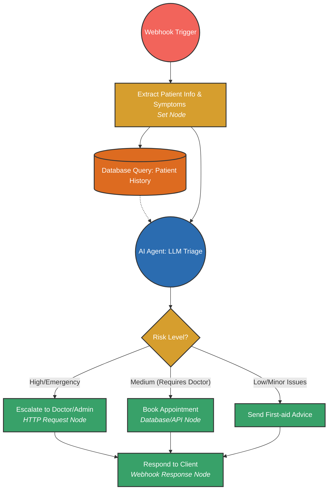

## n8n Workflow Architecture for MediCare Triage AI

This diagram visualizes the flow of data through an n8n automation pipeline from the perspective of a Medical Chatbot processing patient input.

